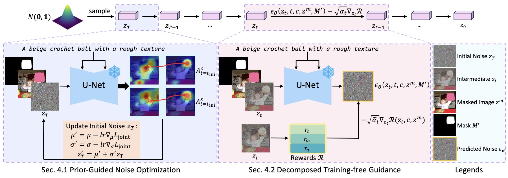

## *FreeInpaint*: Tuning-free Prompt Alignment and Visual Rationality Enhancement in Image Inpainting
<center>

> Chao Gong<sup>1*</sup>, Dong Li<sup>2</sup>, Yingwei Pan<sup>2</sup>, Jingjing Chen<sup>1,3✉️</sup>, Ting Yao<sup>2</sup>, Tao Mei<sup>2</sup><br>
> <sup>1</sup>College of Computer Science and Artificial Intelligence, Fudan University<br>
><sup>2</sup>HiDream.ai Inc. <sup>3</sup>Institute of Trustworthy Embodied AI, Fudan University<br>
><sup>*</sup>This work was performed at HiDream.ai. <sup>✉️</sup>Corresponding author.<br>
Contact us via cgong24@m.fudan.edu.cn.
</center>


## 👂 News
* 🔥🔥 *FreeInpaint* has been accepted by AAAI 2026.

## 🛠️ Method Overview

FreeInpaint is a plug-and-play tuning-free approach for image inpainting that directly optimizes the diffusion latents on the fly during inference to improve the faithfulness of the generated images. Technically, we introduce a prior-guided noise optimization method that steers model attention towards valid inpainting regions by optimizing the initial noise. Furthermore, we meticulously design a composite guidance objective tailored specifically for the inpainting task. This objective efficiently directs the denoising process, enhancing prompt alignment and visual rationality by optimizing intermediate latents at each step.



## TODO
### Code
- [x] Evaluation and Pipeline of BrushNet
- [x] Pipeline of Others (SDI, SDXLI, SD3I, PPT)
- [ ] Evaluation of Others (SDI, SDXLI, SD3I, PPT)
### Results
- [x] Results on our machine

## 🚀 Getting Started

### Environment Requirement 🌍

Freeinpaint has been implemented and tested on Pytorch 2.0.1 with python 3.9.

Clone the repo:

```
git clone https://github.com/CharlesGong12/FreeInpaint.git
```

We recommend you first use `conda` to create virtual environment, and install `pytorch` following [official instructions](https://pytorch.org/). For example:


```
conda create -n freeinpaint python=3.9 -y
conda activate freeinpaint
python -m pip install --upgrade pip
pip install torch==2.0.1 torchvision==0.15.2 torchaudio==2.0.2
```

Then, you can enter this repo and install diffusers (implemented in this repo) with:

```
pip install -e .
```

After that, you can install required packages thourgh:

```
cd examples/freeinpaint/
pip install -r requirements.txt
```

### Download ⬇️

**Dataset**
If you want to run the evaluation in our paper, you need to download and process the [COCO 2017 Validation images](https://cocodataset.org/#download) and [EditBench](https://imagen.research.google/editor/). The COCO re-annotation is located at `examples/freeinpaint/anno/llava-next_annotations_val2017.jsonl`.

**Checkpoints**

FreeInpaint is training-free; you need to download the model you want to apply, such as [stable-diffusion-inpainting](https://huggingface.co/stable-diffusion-v1-5/stable-diffusion-inpainting), [stable-diffusion-xl-inpainting](https://huggingface.co/diffusers/stable-diffusion-xl-1.0-inpainting-0.1), [BrushNet-Random-Mask](https://github.com/TencentARC/BrushNet), [PowerPaint](https://huggingface.co/JunhaoZhuang/PowerPaint-v1), [SD3-Controlnet-Inpainting](https://huggingface.co/alimama-creative/SD3-Controlnet-Inpainting).

## 🏃🏼 Running Scripts

Our code is in `examples/freeinpaint/`. We have now open-sourced the pipeline code for all base models integrated with FreeInpaint, as well as the evaluation code for BrushNet.

You can evaluate BrushNet using the script:

```
python examples/freeinpaint/eval/eval_brushnet_otherbench_optno_guidance.py \
    --brushnet_ckpt_path random_mask_brushnet_ckpt_path \
    --base_model_path realisticVisionV60B1_v51VAE_path \
    --data_dir editbench_path \
    --image_save_path ./outputs/BrushNet-OptNoGuidance/editbench \
    --use_prompt_mask \
    --clip_model_name_or_path openai-clip-vit-large-patch14_path \
    --image_reward_model_name_or_path your_path \
    --pick_processor_name_or_path your_path \
    --pick_model_name_or_path your_path \
    --inpaint_reward_config_path your_path \
    --inpaint_reward_model_path your_path \
    --reward_guidance_scale 25 \
    --overall_reward_scale 0.1 \
    --prompt_reward_scale 4 \
    --harmonic_reward_scale 1 \
    --self_attn_loss_scale 5 \
    --max_round_initno 5 \
    --opt_noise_steps 40 \
    --use_prompt_mask \
```

You need to use your own paths. The `--use_prompt_mask` indicates using prompts that describe the inpainting regions.

#### Note

1. We find different machine may generate different images, thus providing the results on our machine [here](https://drive.google.com/drive/folders/1c6LAjSduCkiMX6LpAymIGEEwHdhq8Q-m?usp=sharing).

2. Additionally, this repository is based on BrushNet, so stable-diffusion-inpainting, stable-diffusion-xl-inpainting, and BrushNet can be run directly. Other pipeline code that cannot be run directly is also provided: if you want to run PowerPaint, since the code repositories are different, you can move `examples/freeinpaint/pipe/pipeline_PowerPaint_optno_guidance.py` to your PowerPaint code path; if you want to run SD3-Controlnet-Inpainting, due to significant differences in environment configurations, you need to update the `diffusers` library.

3. Following [selfcross-guidance](https://github.com/mengtang-lab/selfcross-guidance), the features of the intermediate layers of SD3, layers 7-17, are used during evaluation.

## 🤝🏼 Cite Us

```
@article{gong2025freeinpaint,
  title={FreeInpaint: Tuning-free Prompt Alignment and Visual Rationality Enhancement in Image Inpainting},
  author={Gong, Chao and Li, Dong and Pan, Yingwei and Chen, Jingjing and Yao, Ting and Mei, Tao},
  journal={arXiv preprint arXiv:2512.21104},
  year={2025}
}
```


## 💖 Acknowledgement
<span id="acknowledgement"></span>

Our code references [diffusers](https://github.com/huggingface/diffusers), [BrushNet](https://github.com/TencentARC/BrushNet), [PowerPaint](https://github.com/open-mmlab/PowerPaint), [selfcross-guidance](https://github.com/mengtang-lab/selfcross-guidance) and [InitNO](https://github.com/xiefan-guo/initno), thanks to all the contributors!

